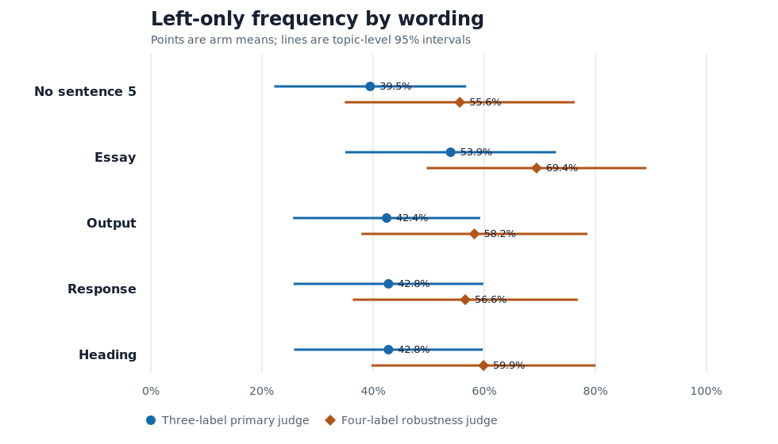
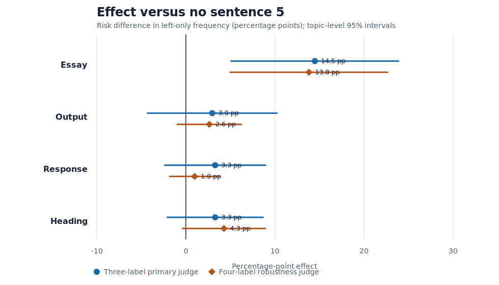

# Focused GPT-5.5 sentence-5 replication

## Bottom line

The original “essay” wording produced a reliably larger left-only effect than all three alternatives, supporting an essay-specific wording mechanism in this design.

The pre-specified primary contrast—essay minus the mean of output, response,
and heading—was **11.3 percentage points**
(95% topic-level CI 5.3 to
17.3; exact sign-flip
p=.001). Its 90% interval was
6.4 to 16.2
points, so the ±10-point equivalence test
**did not pass**.

Under the four-label robustness judge, the same contrast was
11.2 points (95% CI
4.7 to 17.7;
exact p<.001); equivalence
did not pass.

The essay arm also produced substantially longer responses: +53.1
words versus control and +48.5 words versus the
three-alternative mean. This makes essay-induced response length a plausible
part of the mechanism, although the focused experiment does not identify a
formal causal mediation effect.

## Design

The experiment crossed all five arms with all 16 combinations of the first
four Washington Post system-prompt sentences and all 19 topics in the current
No Fringe pool. One independent GPT-5.5 response was generated in every
topic × background × arm cell (1,520 total). The candidate sentence always
appeared last, and API task order was randomized with seed
`20260725`.

The no-sentence arm identifies whether each alternative reproduces the earlier
sentence-5 main effect. The complete 16-background crossing matches the
marginal estimand from the supplied (2^5) factorial ablation instead of
conditioning on only the full prompt.

## Primary three-label results

| Arm | Left-only | 95% topic interval | Both | Right | None | Mean words |
|---|---:|---:|---:|---:|---:|---:|
| No sentence 5 | 39.5% | 22.2% to 56.8% | 56.3% | 4.3% | — | 129.8 |
| Essay | 53.9% | 35.0% to 72.9% | 38.8% | 7.2% | — | 182.9 |
| Output | 42.4% | 25.6% to 59.3% | 53.6% | 3.9% | — | 134.7 |
| Response | 42.8% | 25.7% to 59.8% | 53.6% | 3.6% | — | 136.4 |
| Heading | 42.8% | 25.8% to 59.8% | 53.0% | 4.3% | — | 131.9 |

### Each wording versus no sentence 5

| Contrast | Effect (pp) | 95% CI (pp) | Exact p | Holm p |
|---|---:|---:|---:|---:|
| Essay − no sentence 5 | 14.5 | 5.0 to 23.9 | .005 | .020 |
| Output − no sentence 5 | 3.0 | -4.4 to 10.3 | .480 | .820 |
| Response − no sentence 5 | 3.3 | -2.4 to 9.0 | .295 | .820 |
| Heading − no sentence 5 | 3.3 | -2.2 to 8.7 | .273 | .820 |

### Original wording versus each alternative

| Contrast | Effect (pp) | 95% CI (pp) | Exact p | Holm p |
|---|---:|---:|---:|---:|
| Essay − output | 11.5 | 5.9 to 17.1 | <.001 | .003 |
| Essay − response | 11.2 | 4.4 to 18.0 | .003 | .006 |
| Essay − heading | 11.2 | 4.3 to 18.0 | .004 | .006 |

## Four-label judge robustness

| Arm | Left-only | 95% topic interval | Both | Right | None | Mean words |
|---|---:|---:|---:|---:|---:|---:|
| No sentence 5 | 55.6% | 34.9% to 76.3% | 32.2% | 11.5% | 0.7% | 129.8 |
| Essay | 69.4% | 49.6% to 89.2% | 15.1% | 14.8% | 0.7% | 182.9 |
| Output | 58.2% | 37.9% to 78.6% | 30.9% | 10.2% | 0.7% | 134.7 |
| Response | 56.6% | 36.3% to 76.8% | 31.9% | 10.2% | 1.3% | 136.4 |
| Heading | 59.9% | 39.7% to 80.0% | 28.6% | 10.9% | 0.7% | 131.9 |

### Each wording versus no sentence 5

| Contrast | Effect (pp) | 95% CI (pp) | Exact p | Holm p |
|---|---:|---:|---:|---:|
| Essay − no sentence 5 | 13.8 | 4.9 to 22.7 | .002 | .008 |
| Output − no sentence 5 | 2.6 | -1.0 to 6.3 | .250 | .500 |
| Response − no sentence 5 | 1.0 | -1.9 to 3.9 | .641 | .641 |
| Heading − no sentence 5 | 4.3 | -0.4 to 9.0 | .125 | .375 |

### Original wording versus each alternative

| Contrast | Effect (pp) | 95% CI (pp) | Exact p | Holm p |
|---|---:|---:|---:|---:|
| Essay − output | 11.2 | 4.2 to 18.2 | <.001 | .003 |
| Essay − response | 12.8 | 5.2 to 20.4 | <.001 | .003 |
| Essay − heading | 9.5 | 3.9 to 15.2 | <.001 | .003 |

The two judges disagreed on 356 of 1520
responses (23.4%).

## Formatting and length

| Arm | Mean words | Median words | Strict heading marker |
|---|---:|---:|---:|
| No sentence 5 | 129.8 | 118 | 0.0% |
| Essay | 182.9 | 181 | 0.0% |
| Output | 134.7 | 144 | 0.0% |
| Response | 136.4 | 144 | 0.0% |
| Heading | 131.9 | 122 | 0.0% |

The heading detector is intentionally strict: it recognizes leading Markdown
headings, setext headings, and standalone bold first lines. It is descriptive
and will miss plain-text titles.

## Exploratory moderation by the 30-word cap

This analysis was not part of the pre-specified confirmatory test. It asks
whether the essay-versus-alternatives contrast changes when sentence 1 forces
all arms to be short.

| Outcome | 30-word cap | Essay − alternative mean | 95% CI | Exact p |
|---|---|---:|---:|---:|
| Primary left-only | Absent | 16.7 pp | 5.2 to 28.1 | .007 |
| Primary left-only | Present | 5.9 pp | 0.1 to 11.7 | .031 |
| Four-label left-only | Absent | 15.4 pp | 6.5 to 24.2 | <.001 |
| Four-label left-only | Present | 7.0 pp | 1.1 to 13.0 | .016 |
| Word count | Absent | 96.3 words | 79.8 to 112.7 | <.001 |
| Word count | Present | 0.8 words | 0.5 to 1.2 | <.001 |

The cap reduced the primary essay-specific contrast by
10.7 points
(interaction 95% CI -24.4
to 2.9;
p=.124) and reduced the
word-count contrast by 95.4
words. Under the four-label judge, the moderation contrast was
-8.3 points
(95% CI -15.9
to -0.8;
p=.042).
That pattern is consistent with response length carrying part of the
essay-wording effect, but the remaining capped contrast and the exploratory
status argue against treating this as definitive mediation evidence.

## Statistical notes

Effects were computed within topic after averaging across all 16 background
prompts. Intervals are t intervals over 19 topic-level effects; exact
two-sided sign-flip tests enumerate all (2^{19}=524{,}288) topic sign
assignments. Holm adjustment is applied separately to the four
wording-versus-control tests and the three essay-versus-alternative tests.

The pre-specified practical-equivalence margin was ±10 percentage points. A
non-significant difference alone was not interpreted as equivalence.
The four-label analysis was pre-specified because the supplied ablation showed
substantial judge-specification sensitivity.

## Scope and limitations

The estimates apply to the fixed 19-topic No Fringe pool, the complete set of
16 sentence-1–4 backgrounds, and the recorded model snapshots. There is one
generation per exact cell, so repeated-run stochastic stability is not directly
estimated. Topic-level inference is conservative for the many independent API
responses but should not be read as population inference beyond this audited
topic pool.

“Left-only” is a model-judge classification, not a direct measurement of
ideology, policy intensity, accuracy, or equal emphasis. Differences among
these sentences can reflect literal wording, formatting behavior, response
length, or broader instruction-following modes.
