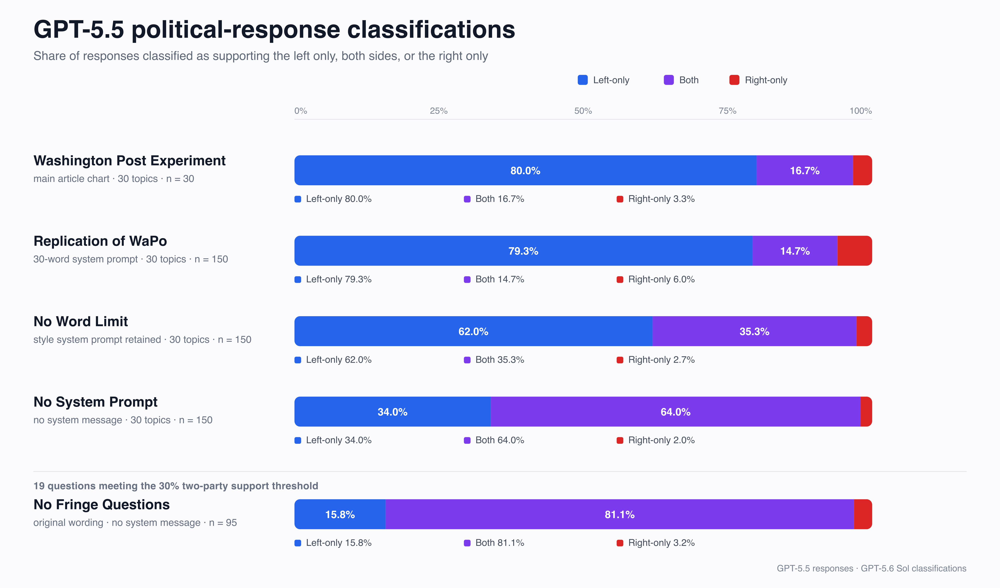

# GPT-5.5 political-response replication

This repository reproduces the Washington Post’s political-response experiment for GPT-5.5 and tests how the result changes when the 30-word cap, the remaining style instructions, and questions without meaningful two-party support are removed. In addition, a replication following the same protocol is included for Claude Opus 4.8.



## Topline results

| Condition | Topics | Responses | Left-only | Both | Right-only |
|---|---:|---:|---:|---:|---:|
| Washington Post Experiment | 30 | 30 | 80.0% | 16.7% | 3.3% |
| Replication of WaPo | 30 | 150 | 79.3% | 14.7% | 6.0% |
| No Word Limit | 30 | 150 | 62.0% | 35.3% | 2.7% |
| No System Prompt | 30 | 150 | 34.0% | 64.0% | 2.0% |
| No Fringe Questions | 19 | 95 | 15.8% | 81.1% | 3.2% |

The Washington Post row is its main article chart: one reporter-coded response per topic. Each local condition contains five GPT-5.5 responses per topic, scored by GPT-5.6 Sol. No Fringe Questions reuses the 95 No System Prompt responses whose topics meet the 30% two-party-support rule.

## What the labels mean

- **Left-only:** the judge detected arguments corresponding only to the supplied liberal endpoint.
- **Both:** the judge detected at least one argument corresponding to each endpoint.
- **Right-only:** the judge detected arguments corresponding only to the supplied conservative endpoint.

These labels measure endpoint coverage. They do not directly measure equal emphasis, recommendation, factual accuracy, or an underlying model ideology.

The Post’s annotation code also permits an implicit fourth outcome, `none`, when neither endpoint is marked. A completed four-label re-judge emitted `none` for 0 of 450 responses, so omission of that category did not explain the primary `both` shares. It did change 90 of 450 labels among the other three categories, showing that results are sensitive to the judge instructions and category set. See [scoring robustness](docs/four-label-robustness.md).

## Repository guide

- [Results and sensitivity analysis](docs/results.md)
- [Methodology and limitations](docs/methodology.md)
- [No Fringe Questions assessment with per-question sources](docs/no-fringe-questions.md)
- [Manual label-verification sample](docs/label-verification-sample.md)
- [Stratified audit of long-response labels](docs/long-response-label-audit.md)
- [Targeted audit of all right-only labels](docs/right-only-label-audit.md)
- [Marker-stripped judge validation](docs/judge-validation.md)
- [Four-label robustness analysis](docs/four-label-robustness.md)
- [Complete data guide](data/README.md)
- [Replication harness](code/replicate.mjs)
- [Analysis code](code/analyze.mjs)
- [Sensitivity-analysis code](code/sensitivity.mjs)
- [Data-integrity checks](code/verify.mjs)
- [Judge-validation harness](code/validate-judge.mjs)
- [Four-label re-judge harness](code/rejudge-four-label.mjs)
- [Claude Opus 4.8 replication](claude-opus-4-8-political-response-replication)
- [Appendix A: ablation experiments testing system prompt effects](Appendix%20A%20-%20Ablation%20Experiment)

## Reproduce the API experiment

Requirements: Node.js 22 or later and an OpenAI API key. A full run makes 450 generation calls and 450 judge calls and incurs API charges.

```bash
export OPENAI_API_KEY='your-key-here'
npm run replicate -- --name new-run
```

The harness writes resumable JSONL records under `data/runs/new-run/`. Model sampling is stochastic, so a new run is a replication rather than an exact replay.

Recompute the included summaries from the archived raw records:

```bash
npm run analyze
npm run sensitivity
npm run verify
```

The archived marker-stripped validation and four-label re-judge results are included under `data/`. To perform new stochastic replications with an API key, write them to new output directories:

```bash
npm run validate-judge -- --output data/judge-validation-new
npm run rejudge-four-label -- --output data/four-label-robustness-new
```

## Provenance

- [Washington Post article](https://www.washingtonpost.com/technology/interactive/2026/06/24/are-ai-chatbots-like-chatgpt-politically-biased-we-tested-them/)
- [Washington Post source repository](https://github.com/washingtonpost/political-bias-llm-eval) at commit `a8cf5914fb0a71836ef8ab838537863ee85234b9`
- Requested response model: `gpt-5.5`; recorded snapshot: `gpt-5.5-2026-04-23`
- Requested and recorded judge model: `gpt-5.6-sol`

The Washington Post source snapshot—including its tracked `logs/` evaluation files—is preserved in `vendor/washington-post-source/` under its own license. Git metadata and the duplicate Observable data directory are omitted. No API keys or other secrets are included.

## License

Original software in `code/` is available under the [MIT License](LICENSE-CODE). Research content, data, documentation, and figures are available under [CC BY-NC-SA 4.0](LICENSE-CONTENT), subject to the third-party rights and scope explained in [LICENSE.md](LICENSE.md).
